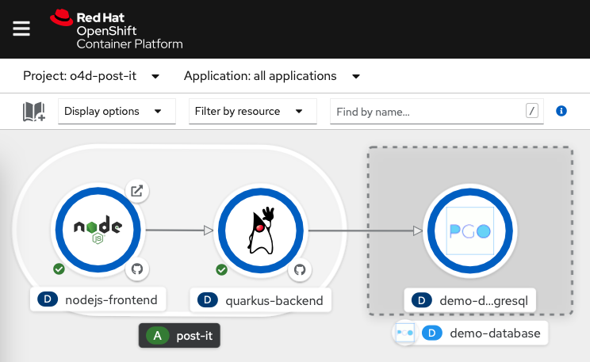

# The Cloud Ready Post-It Application
This is a sample application for the book, Getting Started with OpenShift.

It's a web app that allows users to `list, add, and delete` posts with content.

The Post-It Application that is composed of:
- [a quarkus backend](https://github.com/openshift-for-developers/quarkus-backend)
- [a nodejs react frontend](https://github.com/openshift-for-developers/nodejs-frontend)
- an optionally deployed database

## Application Topology

## Deployment
It is expected for readers of the book to follow the steps outlined in each chapter.  However we provide minimal quickstart instructions below.

### Local Deployment
You are able to run the quarkus application locally using the command:
`mvn compile quarkus:dev`

> Use the `pgsql` branch with *postgresql*.  See [src/main/resources/application.properties](https://github.com/openshift-for-developers/quarkus-backend/blob/main/src/main/resources/application.properties) for connection details using environment variables or the default values.

### OpenShift Deployment
You can find minimal [quickstart instructions at openshift-for-developers/postIt](https://github.com/openshift-for-developers/postIt).

> *Note: this example app is derived from the [example at redhat-developer-demos/quarkus-reactjs-postit-app](https://github.com/redhat-developer-demos/quarkus-reactjs-postit-app).*